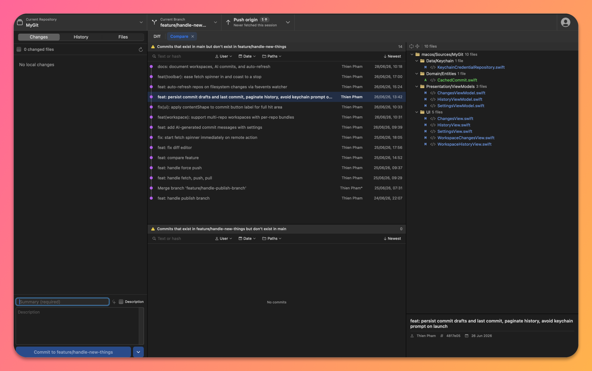
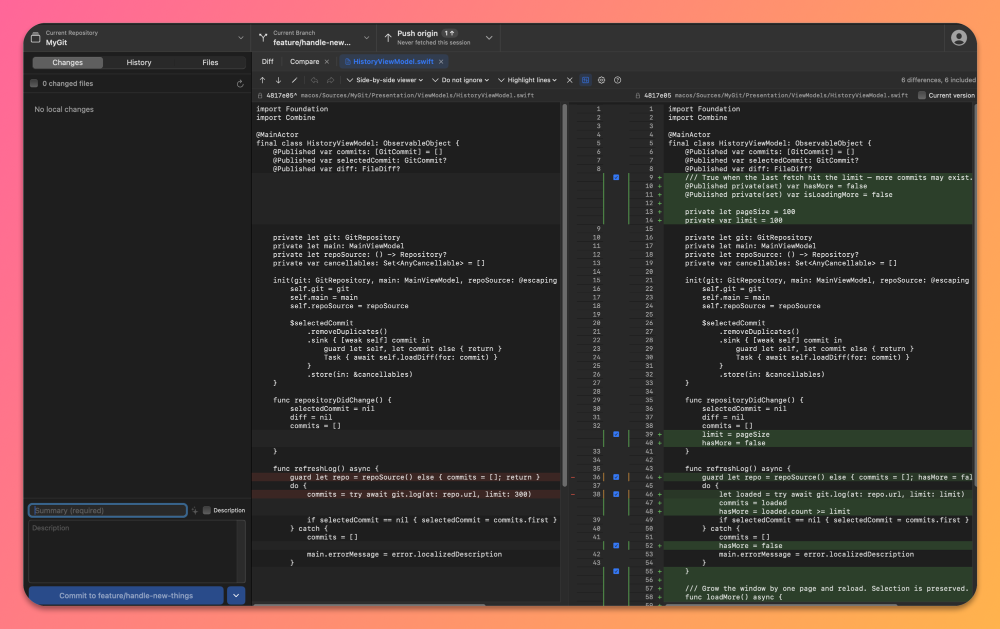

# MyGit

A native, GitHub Desktop–style git client for macOS — built with SwiftUI + AppKit, no third-party dependencies. It drives your existing `/usr/bin/git`, so it works with whatever git already knows about your repos.

> ⚠️ Early-stage / personal project. Useful day-to-day, but expect rough edges.

## Screenshots

**Branch compare** — see exactly which commits exist on one branch but not the other, with the changed-file tree on the right.



**Side-by-side diff** — per-hunk include/exclude, line numbers on both sides, whitespace and highlight options, editable working-tree side.



## Features

- **Multi-repo workspaces** — pick a folder; MyGit scans it (recursively) for git repos and shows them all. A plain repo opens as a single project; a parent folder full of repos (or a repo that nests more repos) opens them side by side.
- **GitHub Desktop–style staging** — check the files you want; commit resets the index and stages only those paths.
- **Commit composer** — summary + description, drafts persisted per repo so you never lose an in-progress message.
- **AI commit messages** — generate a Conventional Commits message from your staged diff via OpenAI, Google Gemini, or any OpenAI-compatible endpoint (Ollama, OpenRouter, 9Router…). Keys live in the keychain.
- **History & branches** — paginated commit log, branch list, create/switch/compare branches.
- **Diff viewer** — side-by-side diffs as in-app tabs (with back/forward history) or detached windows; edit the working-tree side and save straight to disk; per-hunk apply/exclude; whitespace and highlight options.
- **Auto-refresh** — an FSEvents watcher per repo refreshes status, history, and branches when files change on disk. No manual Refresh.
- **HTTPS auth via Personal Access Token** — tokens are stored in MyGit's *own* keychain entry and injected per-command, bypassing `git-credential-osxkeychain` entirely (see [Auth model](#auth-model)).

## Requirements

- macOS 15 (Sequoia) or later
- A Swift 6 toolchain (Xcode 16+ or matching Command Line Tools)
- `/usr/bin/git` (ships with the Xcode CLT)

## Build & run

```bash
cd macos
swift build                 # debug
swift build -c release      # release
```

To actually run it as a proper `.app`, use the bundled script — it does more than `swift build`:

```bash
./run.sh                    # build, bundle MyGit.app, codesign, launch
./run.sh release            # same, release config
```

`run.sh` creates a dedicated `mygit.keychain-db` with a persistent self-signed `MyGit Dev` certificate (one-off), then signs the app with it. This keeps the codesign **designated requirement** constant across rebuilds, so system permissions you grant (keychain access, file prompts) survive future builds instead of re-prompting every time.

Tail logs:

```bash
log stream --predicate 'process == "MyGit"' --level debug
```

## Architecture

AppKit shell + SwiftUI content, in Clean Architecture layers under `macos/Sources/MyGit/`:

- **`Domain/`** — entities (`Repository`, `Workspace`, `AuthOverride`, …) and repository *protocols* only.
- **`Data/`** — concrete implementations: `GitCLIRepository` (shells out to git), `KeychainCredentialRepository`, `UserDefaultsRepoListRepository`, `FileSystemFileEditorRepository`, `AICommitMessageRepository`, plus the FSEvents `RepoWatcher` and `WorkspaceScanner`.
- **`Presentation/ViewModels/`** — one `@MainActor ObservableObject` per feature.
- **`UI/`** — SwiftUI views, each reading the ViewModels it needs as `@EnvironmentObject`.
- **`Git/`** — shared models + parsers (`GitStatus`, `GitLog`, `GitDiff`, `LineDiffer`, …).

Per-repo ViewModels are grouped into a `RepoBundle` (one per repo); `AppCoordinator` holds one bundle per repo in the selected workspace, with `MainViewModel`/`SettingsViewModel` shared across all of them.

All git work shells out to `/usr/bin/git` via `GitRunner` (no shell, args passed as an array) with `GIT_TERMINAL_PROMPT=0` and `LC_ALL=C`. The app is intentionally **unsandboxed** so it can run git against any folder you point it at.

More detail for contributors lives in [`macos/CLAUDE.md`](macos/CLAUDE.md).

## Auth model

A self-signed app gets a fresh codesign identity on most rebuilds, which makes `git-credential-osxkeychain` re-prompt for keychain access constantly. MyGit sidesteps this:

- Personal Access Tokens are stored in MyGit's own keychain entry (service `com.thienpham.MyGit`), keyed by host — independent of the system git credential helper.
- For each fetch/pull/push, MyGit injects the token per-command:
  ```
  -c credential.helper=                              # disable all helpers
  -c http.extraheader=AUTHORIZATION: bearer <PAT>
  ```

Your token never touches the system keychain helper and is redacted from any error output.

## Security notes

- No secrets are committed; PATs and AI API keys are stored only in the keychain at runtime.
- The app is unsandboxed by design (it spawns git against user-selected directories).
- Tokens are passed to git via per-command `-c http.extraheader`. This means the token is briefly visible in the git process's arguments to *other local processes* while a remote command runs. Acceptable for a single-user local tool; not suitable for shared/multi-user machines.

## Contributing

Issues and PRs welcome. There's no test suite yet — `Tests/` is a placeholder; adding tests requires a `.testTarget` in `Package.swift`. Keep new code Swift-5-language-mode compatible (`Package.swift` pins `.swiftLanguageMode(.v5)`).

## License

[MIT](LICENSE) © Thien Pham
